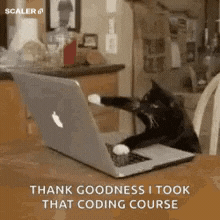

# &lt;Alejandro Rios/&gt;

## Hi!! 👋 My name is Alejandro Rios, I'm from Colombia and I'm a web developer nerd 🤓

<h3>I live in Bogota where I work as a front-end developer on weekdays (and work on my personal projects on weekends), in a nutshell my work is to make web applications for large companies in different sectors</h3>

<h3>I have certificates of knowledge in advanced Angular (my favorite JS framework!✨) and UI/UX design 🎨
 

<h2>In my spare time I develop specific components in angular (toasts, modals, etc...) and I plan to publish them in NPM.</h2>

I have expertise in HTML </img>, CSS </img> (although I prefer  </img>), and Javascript </img> buuuuuut I also like to combine them with some frameworks for example Angular </img> or Vue </img> (in the case of Javascript) or Bootstrap </img> and Tailwind  (in the case of CSS). In back-end side I usually work on Express and MongoDB (perfect combination 🔥)

<h2>Here you can see a small sample of my <a href="https://covid-line-chart.herokuapp.com/" target="_blank">work</a>!!!</h2>

In addition to loving my profession, I am also an electronic engineer👨‍🔧 who loves astronomy 🔭 and things that go around in space 🚀, going to church ⛪ on sundays with my wife and searching for the best burguer 🍔 in town. I like to be learning something new every day 📚.

<h2>You can contact me at <a href="https://luisrios.lar@gmail.com" target="_blank">luisrios.lar@gmail.com</a></h2>
